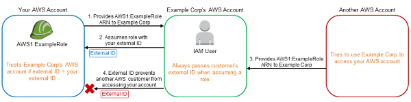

# ConfusedDeputy

## Question



## Answer

Use `ExternalID`

## Building

```shell
sam build 
sam deploy --no-fail-on-empty-changeset --no-confirm-changeset --tags "PLATFORM=SAPC01" 
``` 

## Testing

First, check that as a user in account `<ProductionAccountId>` you have access to the bucket:

```shell
aws --profile <ProductionUser> s3 ls s3://<ProductionBucket>
```

Then, check that as a user in account `<ConfusedDeputyAccountId>` you do not have access to the bucket:

```shell
aws --profile <ConfusedDeputy> s3 ls s3://<ProductionBucket>

An error occurred (AccessDenied) when calling the ListObjectsV2 operation: Access Denied
```

The same for the user in account `<AttackerAccountId>`:

```shell
aws --profile <Attacker> s3 ls s3://<ProductionBucket>

An error occurred (AccessDenied) when calling the ListObjectsV2 operation: Access Denied
```

Now you can let the user in account `<ConfusedDeputyAccountId>` assume the vulnerable role and then access the bucket

```shell
aws --profile <ConfusedDeputy> sts assume-role --role-arn <VulnerableAccessProductionBucketRoleArn> --role-session-name Name
...
aws s3 ls s3://<ProductionBucket>
```

Now you can let the user in account `<ConfusedDeputyAccountId>` assume the resilient role and then access the bucket

```shell
aws --profile <ConfusedDeputy> sts assume-role --role-arn <ResilientAccessProductionBucketRole> --role-session-name Name
...
aws s3 ls s3://<ProductionBucket>

An error occurred (AccessDenied) when calling the ListObjectsV2 operation: Access Denied
```

As shown it is required for the confused deputy to send the `ExternalId` when calling `sts assume-role`
```shell
aws --profile <ConfusedDeputy> sts assume-role --role-arn <ResilientAccessProductionBucketRole> --role-session-name Name --external-id SECRETEXTERNALID
...
aws s3 ls s3://<ProductionBucket>
```


## Cleanup

To delete the sample application that you created, use the AWS CLI. Assuming you used your project name for the stack name, you can run the following:

```shell
aws cloudformation delete-stack --stack-name ConfusedDeputy
```
